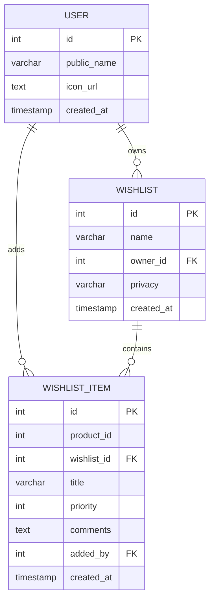

# Simple Database Entity Relationship Diagram (ERD)

## Amazon Wishlist Database Schema - Before Collaboration Features

## Table Descriptions

### User Schema
- **user**: Stores user account information
  - `id`: Primary key, auto-incrementing
  - `public_name`: User's display name
  - `icon_url`: URL to user's profile picture
  - `created_at`: Account creation timestamp

### Wishlist Schema
- **wishlist**: Main wishlist containers
  - `id`: Primary key, auto-incrementing
  - `name`: Wishlist name
  - `owner_id`: Foreign key to user who owns the wishlist
  - `privacy`: Access level (Private/Public)
  - `created_at`: Wishlist creation timestamp

- **wishlist_item**: Individual items in wishlists
  - `id`: Primary key, auto-incrementing
  - `product_id`: Reference to product catalog
  - `wishlist_id`: Foreign key to parent wishlist
  - `title`: Item title/name
  - `priority`: Priority level (0 = lowest)
  - `comments`: General comments about the item (owner's notes)
  - `added_by`: Foreign key to user who added the item
  - `created_at`: Item addition timestamp
  - Unique constraint on (wishlist_id, product_id)

## Key Relationships

1. **User → Wishlist**: One-to-many (a user can own multiple wishlists)
2. **Wishlist → Wishlist Item**: One-to-many (a wishlist can contain multiple items)
3. **User → Wishlist Item**: One-to-many (a user can add multiple items)

## Simple Workflow

1. User creates an account
2. User creates wishlists (owned by them)
3. User adds items to their wishlists
4. Wishlists can be set to Private or Public
5. Public wishlists can be viewed via shareable links (no user authentication required)

## What's Missing (Compared to Full Version)

- **No Collaboration Schema**: No `wishlist_invite`, `wishlist_access`, or `wishlist_item_comment` tables
- **No User-to-User Sharing**: Only public/private visibility, no specific user access control
- **No Comments System**: No separate comment threads on items
- **No Invitation System**: No way to invite specific users to collaborate
- **No Role-Based Access**: No view_only, view_edit, comment_only roles

## Privacy Levels

- **Private**: Only the owner can view and edit
- **Public**: Anyone with the link can view (read-only access)

This represents the basic wishlist functionality before any collaborative features were implemented. 