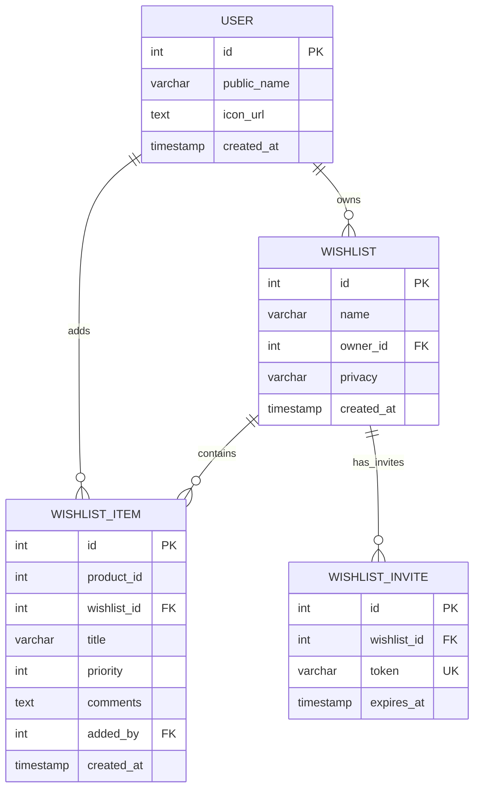

# Simple Database Entity Relationship Diagram (ERD)

## Amazon Wishlist Database Schema - Before Advanced Collaboration Features

## Table Descriptions

### User Schema
- **user**: Stores user account information
  - `id`: Primary key, auto-incrementing
  - `public_name`: User's display name
  - `icon_url`: URL to user's profile picture
  - `created_at`: Account creation timestamp

### Wishlist Schema
- **wishlist**: Main wishlist containers
  - `id`: Primary key, auto-incrementing
  - `name`: Wishlist name
  - `owner_id`: Foreign key to user who owns the wishlist
  - `privacy`: Access level (Private/Public)
  - `created_at`: Wishlist creation timestamp

- **wishlist_item**: Individual items in wishlists
  - `id`: Primary key, auto-incrementing
  - `product_id`: Reference to product catalog
  - `wishlist_id`: Foreign key to parent wishlist
  - `title`: Item title/name
  - `priority`: Priority level (0 = lowest)
  - `comments`: General comments about the item (owner's notes)
  - `added_by`: Foreign key to user who added the item
  - `created_at`: Item addition timestamp
  - Unique constraint on (wishlist_id, product_id)

### Simple Invitation Schema
- **wishlist_invite**: Invitation tokens for sharing wishlists (view-only)
  - `id`: Primary key, auto-incrementing
  - `wishlist_id`: Foreign key to wishlist being shared
  - `token`: Unique invitation token
  - `expires_at`: Token expiration timestamp
  - Note: No `access_type` field - all invites are view-only

## Key Relationships

1. **User → Wishlist**: One-to-many (a user can own multiple wishlists)
2. **Wishlist → Wishlist Item**: One-to-many (a wishlist can contain multiple items)
3. **User → Wishlist Item**: One-to-many (a user can add multiple items)
4. **Wishlist → Wishlist Invite**: One-to-many (a wishlist can have multiple invitation tokens)

## Simple Workflow

1. User creates an account
2. User creates wishlists (owned by them)
3. User adds items to their wishlists
4. User can share wishlists in two ways:
   - **Public**: Anyone with the link can view (no authentication required)
   - **Private with Invite**: Generate invitation token for view-only access
5. Invited users can view the wishlist using the token (no account required)

## What's Missing (Compared to Full Version)

- **No User Access Tracking**: No `wishlist_access` table to track who has accepted invites
- **No Comments System**: No `wishlist_item_comment` table for threaded comments
- **No Role-Based Access**: No view_edit or comment_only roles - only view-only
- **No User Authentication for Invites**: Invited users don't need accounts
- **No Display Names**: No per-wishlist custom names for collaborators

## Privacy Levels

- **Private**: Only the owner can view and edit, unless shared via invite token
- **Public**: Anyone with the link can view (read-only access)

## Invitation System

- Owner generates invitation tokens for private wishlists
- Tokens have expiration dates
- Anyone with a valid token can view the wishlist (no account required)
- All invited access is view-only (no editing, no commenting)
- No tracking of who has used the tokens

This represents the wishlist functionality with basic invitation sharing but without the advanced collaboration features. 