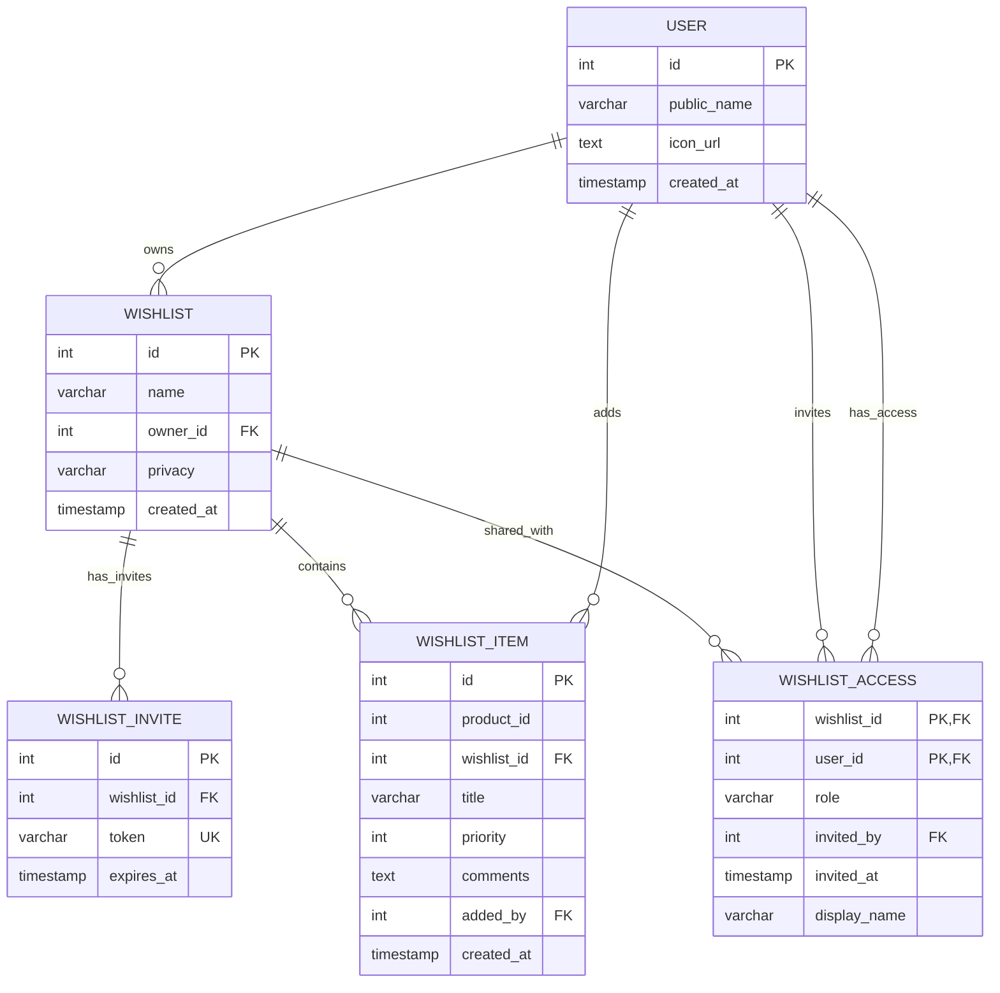

# Simple Database Entity Relationship Diagram (ERD)

## Amazon Wishlist Database Schema - Before Advanced Collaboration Features

## Table Descriptions

### User Schema
- **user**: Stores user account information
  - `id`: Primary key, auto-incrementing
  - `public_name`: User's display name
  - `icon_url`: URL to user's profile picture
  - `created_at`: Account creation timestamp

### Wishlist Schema
- **wishlist**: Main wishlist containers
  - `id`: Primary key, auto-incrementing
  - `name`: Wishlist name
  - `owner_id`: Foreign key to user who owns the wishlist
  - `privacy`: Access level (Private/Public)
  - `created_at`: Wishlist creation timestamp

- **wishlist_item**: Individual items in wishlists
  - `id`: Primary key, auto-incrementing
  - `product_id`: Reference to product catalog
  - `wishlist_id`: Foreign key to parent wishlist
  - `title`: Item title/name
  - `priority`: Priority level (0 = lowest)
  - `comments`: General comments about the item (owner's notes)
  - `added_by`: Foreign key to user who added the item
  - `created_at`: Item addition timestamp
  - Unique constraint on (wishlist_id, product_id)

### Simple Invitation Schema
- **wishlist_invite**: Invitation tokens for sharing wishlists (view-only)
  - `id`: Primary key, auto-incrementing
  - `wishlist_id`: Foreign key to wishlist being shared
  - `token`: Unique invitation token
  - `expires_at`: Token expiration timestamp
  - Note: No `access_type` field - all invites are view-only

### Simple Access Tracking
- **wishlist_access**: Tracks who has access to shared wishlists (for Manage People modal)
  - `wishlist_id`: Composite primary key with user_id
  - `user_id`: Composite primary key with wishlist_id
  - `role`: Access role (always 'view_only' in this simple version)
  - `invited_by`: Foreign key to user who sent the invitation
  - `invited_at`: When access was granted
  - `display_name`: Custom name for this user in this wishlist

## Key Relationships

1. **User → Wishlist**: One-to-many (a user can own multiple wishlists)
2. **Wishlist → Wishlist Item**: One-to-many (a wishlist can contain multiple items)
3. **User → Wishlist Item**: One-to-many (a user can add multiple items)
4. **Wishlist → Wishlist Invite**: One-to-many (a wishlist can have multiple invitation tokens)
5. **Wishlist → Wishlist Access**: One-to-many (a wishlist can be shared with multiple users)
6. **User → Wishlist Access**: One-to-many (a user can have access to multiple wishlists)

## Simple Workflow

1. User creates an account
2. User creates wishlists (owned by them)
3. User adds items to their wishlists
4. User can share wishlists in two ways:
   - **Public**: Anyone with the link can view (no authentication required)
   - **Private with Invite**: Generate invitation token for view-only access
5. When someone accepts an invite, they get an entry in `wishlist_access`
6. Owner can manage people via modal and remove viewers

## Manage People Modal Functionality

- Shows list of users with access to the wishlist
- Owner can see who has been invited and when
- Owner can remove users from access (delete from `wishlist_access`)
- All users shown have 'view_only' role
- No ability to change roles or add new collaborators

## What's Missing (Compared to Full Version)

- **No Comments System**: No `wishlist_item_comment` table for threaded comments
- **No Role-Based Access**: No view_edit or comment_only roles - only view-only
- **No Advanced Invitation**: No `access_type` field in invites - all are view-only
- **No User Authentication for Public**: Public wishlists don't require accounts

## Privacy Levels

- **Private**: Only the owner can view and edit, unless shared via invite token
- **Public**: Anyone with the link can view (read-only access)

## Invitation System

- Owner generates invitation tokens for private wishlists
- Tokens have expiration dates
- When someone accepts an invite, they get an entry in `wishlist_access`
- All invited access is view-only (no editing, no commenting)
- Owner can manage and remove users via the Manage People modal

This represents the wishlist functionality with basic invitation sharing and user management, but without advanced collaboration features like comments and role-based access. 