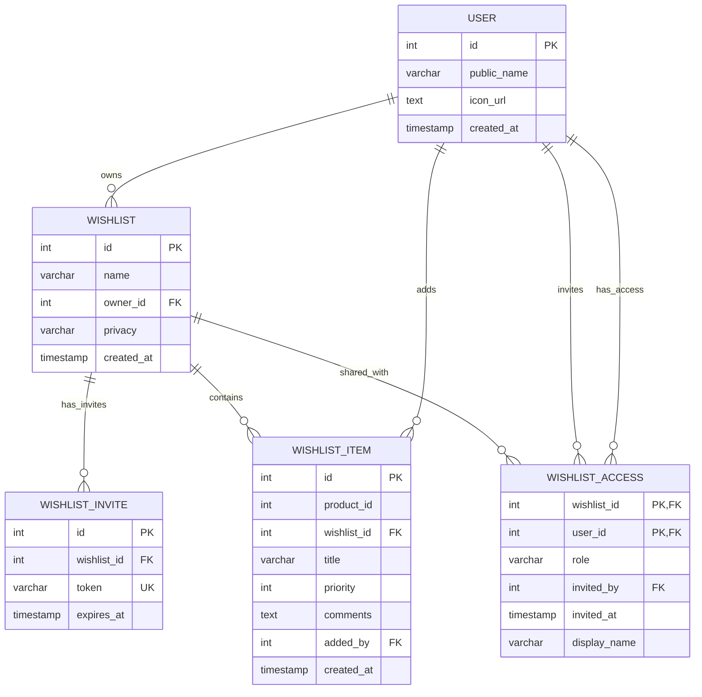

# Database Entity Relationship Diagram (ERD) - Basic Version

## Overview

This document describes the simplified database schema for the Amazon collaborative wishlist application **before** advanced collaboration features. This represents the core wishlist functionality with basic invitation sharing and user management, but without comments and role-based access control.

## 🏗️ Database Architecture

The database uses **PostgreSQL** with **schema separation** to organize different domains:
- `user` schema: User management
- `wishlist` schema: Wishlist and item management  
- `collab` schema: Basic collaboration and sharing

## 📊 Basic ERD Diagram



## 🗄️ Table Descriptions

### User Schema (`user`)

#### User Table (`user.user`)
```sql
CREATE TABLE "user".user (
    id SERIAL PRIMARY KEY,
    public_name VARCHAR(255) NOT NULL,
    icon_url TEXT,
    created_at TIMESTAMP DEFAULT CURRENT_TIMESTAMP
);
```

**Purpose**: Stores user account information and profiles.

**Fields**:
- `id`: Primary key, auto-incrementing user identifier
- `public_name`: User's display name (required)
- `icon_url`: URL to user's profile picture (optional)
- `created_at`: Account creation timestamp

**Indexes**:
- Primary key on `id`
- Consider index on `public_name` for search functionality

### Wishlist Schema (`wishlist`)

#### Wishlist Table (`wishlist.wishlist`)
```sql
CREATE TABLE "wishlist".wishlist (
    id SERIAL PRIMARY KEY,
    name VARCHAR(255) NOT NULL,
    owner_id INTEGER NOT NULL REFERENCES "user".user(id),
    privacy VARCHAR(50) DEFAULT 'Private',
    created_at TIMESTAMP DEFAULT CURRENT_TIMESTAMP
);
```

**Purpose**: Main wishlist containers that users create and manage.

**Fields**:
- `id`: Primary key, auto-incrementing wishlist identifier
- `name`: Wishlist name (required)
- `owner_id`: Foreign key to user who owns the wishlist (required)
- `privacy`: Access level - 'Private' or 'Public' (default: 'Private')
- `created_at`: Wishlist creation timestamp

**Constraints**:
- Foreign key constraint on `owner_id` references `user.user(id)`
- NOT NULL constraints on `name` and `owner_id`

**Indexes**:
- Primary key on `id`
- Index on `owner_id` for efficient user wishlist queries
- Consider index on `privacy` for filtering

#### Wishlist Item Table (`wishlist.wishlist_item`)
```sql
CREATE TABLE "wishlist".wishlist_item (
    id SERIAL PRIMARY KEY,
    product_id INTEGER NOT NULL,
    wishlist_id INTEGER NOT NULL REFERENCES "wishlist".wishlist(id),
    title VARCHAR(255) NOT NULL,
    priority INTEGER DEFAULT 0,
    comments TEXT,
    added_by INTEGER NOT NULL REFERENCES "user".user(id),
    created_at TIMESTAMP DEFAULT CURRENT_TIMESTAMP,
    UNIQUE(wishlist_id, product_id)
);
```

**Purpose**: Individual items within wishlists, linked to product catalog.

**Fields**:
- `id`: Primary key, auto-incrementing item identifier
- `product_id`: Reference to product catalog (required)
- `wishlist_id`: Foreign key to parent wishlist (required)
- `title`: Item title/name (required)
- `priority`: Priority level for sorting (default: 0, lower = higher priority)
- `comments`: General comments about the item (owner's notes, optional)
- `added_by`: Foreign key to user who added the item (required)
- `created_at`: Item addition timestamp

**Constraints**:
- Foreign key constraint on `wishlist_id` references `wishlist.wishlist(id)`
- Foreign key constraint on `added_by` references `user.user(id)`
- Unique constraint on `(wishlist_id, product_id)` prevents duplicate products
- NOT NULL constraints on `product_id`, `wishlist_id`, `title`, `added_by`

**Indexes**:
- Primary key on `id`
- Index on `wishlist_id` for efficient item queries
- Index on `added_by` for user activity tracking
- Unique index on `(wishlist_id, product_id)` for constraint enforcement
- Consider index on `priority` for sorting

### Collaboration Schema (`collab`)

#### Wishlist Invite Table (`collab.wishlist_invite`)
```sql
CREATE TABLE "collab".wishlist_invite (
    id SERIAL PRIMARY KEY,
    wishlist_id INTEGER NOT NULL REFERENCES "wishlist".wishlist(id),
    token VARCHAR(255) UNIQUE NOT NULL,
    expires_at TIMESTAMP NOT NULL
);
```

**Purpose**: Manages invitation tokens for sharing wishlists with other users (view-only access).

**Fields**:
- `id`: Primary key, auto-incrementing invite identifier
- `wishlist_id`: Foreign key to wishlist being shared (required)
- `token`: Unique invitation token for sharing (required, unique)
- `expires_at`: Token expiration timestamp (required)
- **Note**: No `access_type` field - all invites are view-only

**Constraints**:
- Foreign key constraint on `wishlist_id` references `wishlist.wishlist(id)`
- Unique constraint on `token`
- NOT NULL constraints on all fields

**Indexes**:
- Primary key on `id`
- Unique index on `token` for fast token lookups
- Index on `wishlist_id` for wishlist-specific queries
- Index on `expires_at` for cleanup operations

#### Wishlist Access Table (`collab.wishlist_access`)
```sql
CREATE TABLE "collab".wishlist_access (
    wishlist_id INTEGER NOT NULL REFERENCES "wishlist".wishlist(id),
    user_id INTEGER NOT NULL REFERENCES "user".user(id),
    role VARCHAR(50) NOT NULL,
    invited_by INTEGER NOT NULL REFERENCES "user".user(id),
    invited_at TIMESTAMP DEFAULT CURRENT_TIMESTAMP,
    display_name VARCHAR(255),
    PRIMARY KEY (wishlist_id, user_id)
);
```

**Purpose**: Tracks who has access to shared wishlists (for Manage People modal).

**Fields**:
- `wishlist_id`: Composite primary key with user_id, foreign key to wishlist (required)
- `user_id`: Composite primary key with wishlist_id, foreign key to user (required)
- `role`: Access role (always 'view_only' in this simple version)
- `invited_by`: Foreign key to user who sent the invitation (required)
- `invited_at`: When access was granted (default: current timestamp)
- `display_name`: Custom name for this user in this wishlist (optional)

**Constraints**:
- Composite primary key on `(wishlist_id, user_id)`
- Foreign key constraint on `wishlist_id` references `wishlist.wishlist(id)`
- Foreign key constraint on `user_id` references `user.user(id)`
- Foreign key constraint on `invited_by` references `user.user(id)`
- NOT NULL constraints on `wishlist_id`, `user_id`, `role`, `invited_by`

**Indexes**:
- Composite primary key on `(wishlist_id, user_id)`
- Index on `user_id` for user access queries
- Index on `invited_by` for invitation tracking

## 🔗 Key Relationships

### One-to-Many Relationships
1. **User → Wishlist**: A user can own multiple wishlists
2. **User → Wishlist Item**: A user can add multiple items to wishlists
3. **User → Wishlist Access**: A user can have access to multiple wishlists
4. **Wishlist → Wishlist Item**: A wishlist can contain multiple items
5. **Wishlist → Wishlist Invite**: A wishlist can have multiple invitation tokens
6. **Wishlist → Wishlist Access**: A wishlist can be shared with multiple users

### Many-to-Many Relationships
1. **User ↔ Wishlist**: Through `wishlist_access` table (collaboration)

## 🔐 Access Control Flow

### 1. Wishlist Creation
```sql
-- User creates a wishlist (becomes owner)
INSERT INTO "wishlist".wishlist (name, owner_id, privacy) 
VALUES ('My Birthday List', 1, 'Private');
```

### 2. Invitation Generation
```sql
-- Owner generates invitation token (view-only)
INSERT INTO "collab".wishlist_invite (wishlist_id, token, expires_at)
VALUES (1, 'abc123def456', '2024-01-15 12:00:00');
```

### 3. Invitation Acceptance
```sql
-- Invited user accepts and gets view-only access
INSERT INTO "collab".wishlist_access (wishlist_id, user_id, role, invited_by, display_name)
VALUES (1, 2, 'view_only', 1, 'Alice');
```

### 4. Access Levels
- **view_only**: Can view items (all invited access is view-only)
- **owner**: Full access to wishlist

## 📊 Data Flow Examples

### Creating a Wishlist with Items
```sql
-- 1. Create wishlist
INSERT INTO "wishlist".wishlist (name, owner_id, privacy) 
VALUES ('Christmas List', 1, 'Private') RETURNING id;

-- 2. Add items
INSERT INTO "wishlist".wishlist_item (product_id, wishlist_id, title, priority, added_by)
VALUES 
  (101, 1, 'Wireless Headphones', 1, 1),
  (102, 1, 'Coffee Maker', 2, 1);
```

### Sharing a Wishlist
```sql
-- 1. Create invitation (view-only)
INSERT INTO "collab".wishlist_invite (wishlist_id, token, expires_at)
VALUES (1, 'xyz789abc123', '2024-01-20 12:00:00');

-- 2. User accepts invitation (gets view-only access)
INSERT INTO "collab".wishlist_access (wishlist_id, user_id, role, invited_by)
VALUES (1, 2, 'view_only', 1);
```

## 🔧 Database Maintenance

### Cleanup Operations
```sql
-- Remove expired invitations
DELETE FROM "collab".wishlist_invite 
WHERE expires_at < NOW();
```

### Performance Optimizations
```sql
-- Add indexes for common queries
CREATE INDEX idx_wishlist_owner ON "wishlist".wishlist(owner_id);
CREATE INDEX idx_wishlist_item_wishlist ON "wishlist".wishlist_item(wishlist_id);
CREATE INDEX idx_wishlist_access_user ON "collab".wishlist_access(user_id);
CREATE INDEX idx_invite_token ON "collab".wishlist_invite(token);
CREATE INDEX idx_invite_expires ON "collab".wishlist_invite(expires_at);
```

## 🛡️ Security Considerations

### Data Protection
- Foreign key constraints ensure referential integrity
- Unique constraints prevent duplicate data
- NOT NULL constraints ensure required data

### Access Control
- Simple view-only permissions in `wishlist_access`
- Token-based invitations with expiration
- User context validation at application level

### Privacy Levels
- **Private**: Only owner and invited users can access
- **Public**: Anyone with the link can view (read-only access)

## 📈 Scalability Considerations

### Partitioning Opportunities
- Access table could be partitioned by `wishlist_id`
- Invites table could be partitioned by creation date

### Caching Strategies
- User profiles for frequent lookups
- Wishlist metadata for popular lists

### Archival Strategy
- Archive expired invitations
- Maintain access history for audit trails

## 🔄 Simple Workflow

### 1. User Account Creation
- User creates an account in the `user` table
- Gets a unique user ID and profile information

### 2. Wishlist Creation
- User creates wishlists in the `wishlist` table
- Each wishlist has an owner and privacy setting

### 3. Item Management
- User adds items to their wishlists
- Items are stored in `wishlist_item` table
- Each item has a product reference and priority

### 4. Sharing Options
- **Public**: Anyone with the link can view (no authentication required)
- **Private with Invite**: Generate invitation token for view-only access

### 5. Invitation Process
- Owner generates invitation token in `wishlist_invite`
- Token has expiration date
- When someone accepts an invite, they get an entry in `wishlist_access`

### 6. Manage People Modal
- Shows list of users with access to the wishlist
- Owner can see who has been invited and when
- Owner can remove users from access (delete from `wishlist_access`)
- All users shown have 'view_only' role

## ❌ What's Missing (Compared to Full Version)

### No Comments System
- No `wishlist_item_comment` table for threaded comments
- No comment functionality in the application
- Item comments field is for owner's notes only

### No Role-Based Access
- No `view_edit` or `comment_only` roles
- Only `view_only` access for invited users
- No ability to change roles or add new collaborators

### No Advanced Invitation
- No `access_type` field in invites
- All invitations are view-only
- No granular permission control

### No User Authentication for Public
- Public wishlists don't require accounts
- No tracking of who views public wishlists

## 🎯 Key Benefits of Basic Version

1. **Simplicity**: Easier to understand and implement
2. **Faster Development**: Fewer features to build and test
3. **Reduced Complexity**: Less database complexity
4. **Core Functionality**: Still provides essential wishlist features
5. **Foundation**: Can be extended to full version later

## 🔄 Migration Path to Full Version

To upgrade from basic to full version:

1. **Add Comments Table**:
   ```sql
   CREATE TABLE "collab".wishlist_item_comment (
       id SERIAL PRIMARY KEY,
       wishlist_item_id INTEGER NOT NULL REFERENCES "wishlist".wishlist_item(id),
       user_id INTEGER NOT NULL REFERENCES "user".user(id),
       comment_text TEXT NOT NULL,
       created_at TIMESTAMP DEFAULT CURRENT_TIMESTAMP
   );
   ```

2. **Add Access Type to Invites**:
   ```sql
   ALTER TABLE "collab".wishlist_invite 
   ADD COLUMN access_type VARCHAR(20) NOT NULL DEFAULT 'view_only';
   ```

3. **Update Application Logic**:
   - Add comment functionality
   - Implement role-based access control
   - Add permission validation for different roles

This basic version provides a solid foundation that can be extended with advanced collaboration features as needed. 