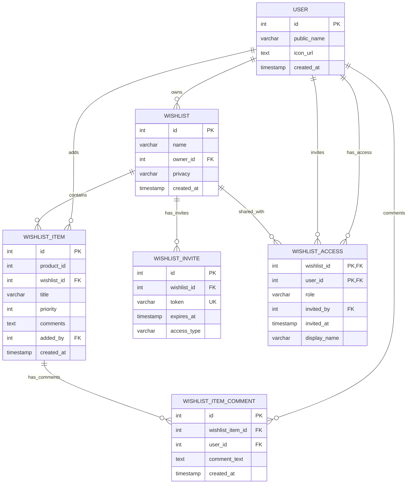

# Database Entity Relationship Diagram (ERD)

## Amazon Collaborative Wishlist Database Schema

## Table Descriptions

### User Schema
- **user**: Stores user account information
  - `id`: Primary key, auto-incrementing
  - `public_name`: User's display name
  - `icon_url`: URL to user's profile picture
  - `created_at`: Account creation timestamp

### Wishlist Schema
- **wishlist**: Main wishlist containers
  - `id`: Primary key, auto-incrementing
  - `name`: Wishlist name
  - `owner_id`: Foreign key to user who owns the wishlist
  - `privacy`: Access level (Private/Public/Shared)
  - `created_at`: Wishlist creation timestamp

- **wishlist_item**: Individual items in wishlists
  - `id`: Primary key, auto-incrementing
  - `product_id`: Reference to product catalog
  - `wishlist_id`: Foreign key to parent wishlist
  - `title`: Item title/name
  - `priority`: Priority level (0 = lowest)
  - `comments`: General comments about the item
  - `added_by`: Foreign key to user who added the item
  - `created_at`: Item addition timestamp
  - Unique constraint on (wishlist_id, product_id)

### Collaboration Schema
- **wishlist_invite**: Invitation tokens for sharing wishlists
  - `id`: Primary key, auto-incrementing
  - `wishlist_id`: Foreign key to wishlist being shared
  - `token`: Unique invitation token
  - `expires_at`: Token expiration timestamp
  - `access_type`: Type of access granted (view_only/view_edit/comment_only)

- **wishlist_access**: User access permissions for shared wishlists
  - `wishlist_id`: Composite primary key with user_id
  - `user_id`: Composite primary key with wishlist_id
  - `role`: Access role (view_only/view_edit/comment_only)
  - `invited_by`: Foreign key to user who sent the invitation
  - `invited_at`: Invitation acceptance timestamp
  - `display_name`: Custom name for this user in this wishlist

- **wishlist_item_comment**: Comments on individual wishlist items
  - `id`: Primary key, auto-incrementing
  - `wishlist_item_id`: Foreign key to item being commented on
  - `user_id`: Foreign key to user making the comment
  - `comment_text`: The comment content
  - `created_at`: Comment creation timestamp

## Key Relationships

1. **User → Wishlist**: One-to-many (a user can own multiple wishlists)
2. **Wishlist → Wishlist Item**: One-to-many (a wishlist can contain multiple items)
3. **User → Wishlist Item**: One-to-many (a user can add multiple items)
4. **Wishlist → Wishlist Access**: One-to-many (a wishlist can be shared with multiple users)
5. **User → Wishlist Access**: One-to-many (a user can have access to multiple wishlists)
6. **Wishlist Item → Comment**: One-to-many (an item can have multiple comments)
7. **User → Comment**: One-to-many (a user can make multiple comments)

## Access Control Flow

1. User creates a wishlist (becomes owner)
2. Owner can invite others via `wishlist_invite` tokens
3. Invited users accept and get entries in `wishlist_access`
4. Access levels determine what users can do:
   - `view_only`: Can view items and comments
   - `view_edit`: Can view, edit items, and comment
   - `comment_only`: Can view items and add comments 